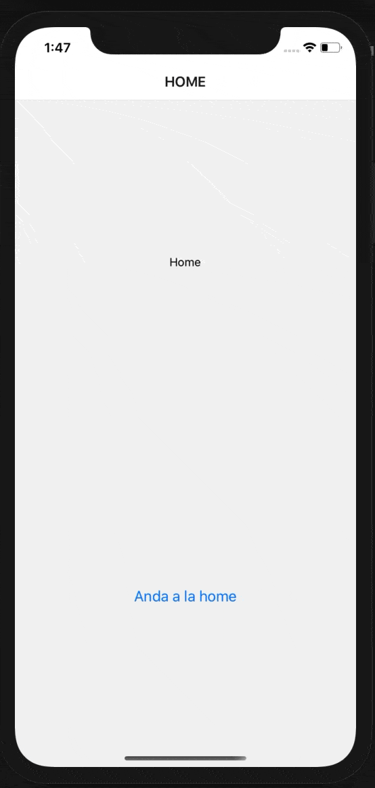
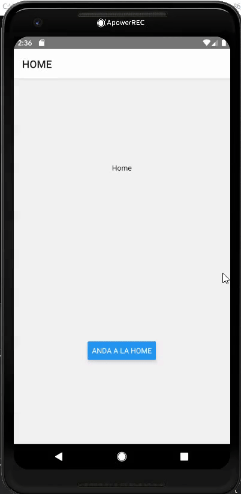

# Demo App React Native

Esta demo app utiliza
* [React Native v0.63.3](https://reactnative.dev/blog/2020/07/06/version-0.63)
* [React Navigation 5](https://reactnavigation.org/docs/getting-started)
* [Axios](https://github.com/axios/axios#axios)
* [Redux](https://es.redux.js.org/)
* [Redux Toolkit](https://redux-toolkit.js.org/)
* [Redux Thunk](https://github.com/reduxjs/redux-thunk)

## Comparación entre Android y IOS
La App utiliza los componentes default de React Native los cuales buscan simular el look and feel nativo de cada plataforma. Es por esto que el build se vera diferente entre ambas plataformas.


**IOS**

 


**ANDROID**



> Las diferencias entre componentes no son muchas pero es importante saber que pueden aparecer y pueden llegar a ser fuentes de algunos dolores de cabeza cuando el componente no se ve como esperamos, por ejemplo al momento de [aplicar sombras](https://medium.com/game-development-stuff/how-to-apply-shadows-on-react-native-fa745d374ae7) donde las APIs que utilizan son completamente diferentes.

## Troubleshooting
### No me marca errores en mi codigo
Instalar las extensiones [ESLint](https://marketplace.visualstudio.com/items?itemName=dbaeumer.vscode-eslint) y [Prettier ESLint](https://marketplace.visualstudio.com/items?itemName=rvest.vs-code-prettier-eslint)


Luego de instalar `Prettier ESLint` ir a algun archivo `.js`, abrirlo y presionar click derecho sobre el editor y luego presionar `Format Document With...` -> `Configure Default Formatter` -> `Prettier ESLint`

Ahora al presionar `Shift + Alt + F` se formateara el codigo segun las reglas de `ESLint`

>Opcional: Si queresmos que nuestro codigo se formatee al guardar podemos ir a `File` -> `Preferences` -> `Settings` y en la barra de busqueda tipear `Format On Save` para luego tildar la opcion. Luego, al apretar `Ctrl + S` en nuestros archivos automaticamente seran formateados segun las reglas de linteo.


### No me sugiere imports
Para agregar sugerencias en los imports es necesario crear el archivo `jsconfig.json` con los siguientes contenidos
```
{
    "compilerOptions": {
        "target": "ES6",
        "module": "commonjs",
        "allowSyntheticDefaultImports": true,
        "resolveJsonModule": true,
        "checkJs": true,
        "jsx": "react-native"
    },
    "exclude": [
        "node_modules"
    ]
}
```

Ademas instalar la extension [Auto Import - ES6, TS, JSX, TSX](https://marketplace.visualstudio.com/items?itemName=NuclleaR.vscode-extension-auto-importv)

> NOTA: Puede que sea necesario que reinicies vs code para ver los cambios

### ERROR: Falla al instalar la APP en Android
Si vemos un error similar al siguiente
```
info Installing the app...

error Failed to install the app. Make sure you have the Android development environment set up: https://reactnative.dev/docs/environment-setup. Run CLI with --verbose flag for more details.
Error: spawn ./gradlew EACCES
    at Process.ChildProcess._handle.onexit (internal/child_process.js:240:19)
```

Esto suele ocurrir la primera vez que tratamos de ejecutar nuestro proyecto `Android`, para solucionarlo simplemente abrir la carpeta `android` de este proyecto utilizando Android Studio y dejar que complete la sincronizacion. Luego podemos volver a ejecutar `npx react-native run-android` sin este problema

### ERROR: Falla al intentar correr la APP en iOS
Para correr nuestra app utilizando el comando `npx react-native run-ios` es necesario contar con una Mac con XCode instalado en una versión reciente (release actual o previo).

Ademas, si es la primera vez que ejecutas la mac es necesario ejecutar

```
cd ios && pod install && cd ..
```

Luego hay que abrir nuestro proyecto `ios` desde xcode mediante
```
xed ios
```
Finalmente revisar si las `Signings & Capabilities` del proyecto tienen nuestros datos personales o del equipo al que pertenezcamos ya que sino no nos permitira buildear (esto suele ocurrir cuando compartimos el proyecto en github sin un equipo configurado desde el portal de Apple Developers)

Luego podemos volver a ejecutar `npx react-native run-ios` y no deberiamos tener mayores complicaciones.

### ERROR: Unable to run script [...] 
Este error suele aparecer porque instalamos nuevos packages nuevos mientras teniamos el metro bundler abierto. Para solucionarlo solo hay que cerrarlo y volver a ejecutar `npx react-native run-android`


### Borrar node_modules en Windows
Instalar Rimraf
```
npm install rimraf -g
```

Ejecutar 
```
rimraf node_modules
```